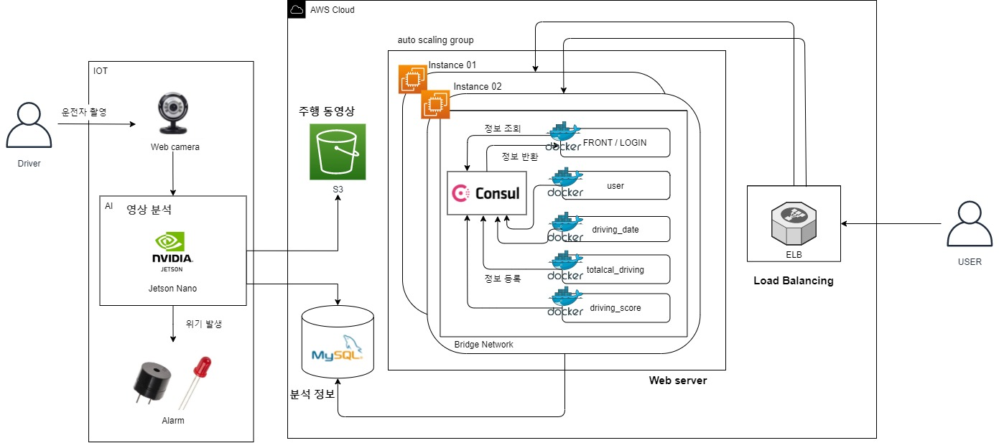

# multiCampus_Driving_assistance
멀티캠퍼스 융합프로젝트 : 주행 보조 시스템
클라우드파트

### :gem: Developers

---

- 유민지 https://github.com/MinjiY
- 양승현 https://github.com/1yangsh 

### 🐼 Tech Stack

---

- Flask Framework
- AWS S3/RDS/ELB
- consul
- docker, docker-compose
- Auth0

### 🎆 Architecture

---

